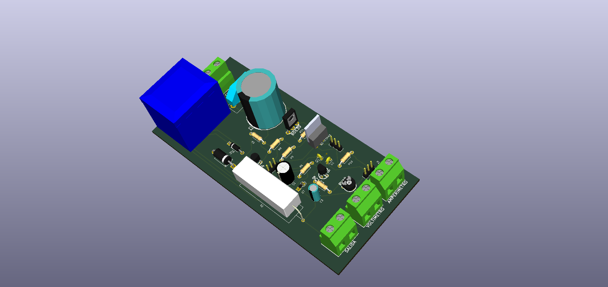
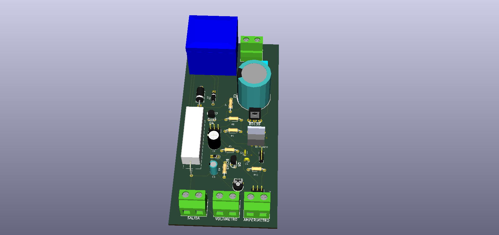
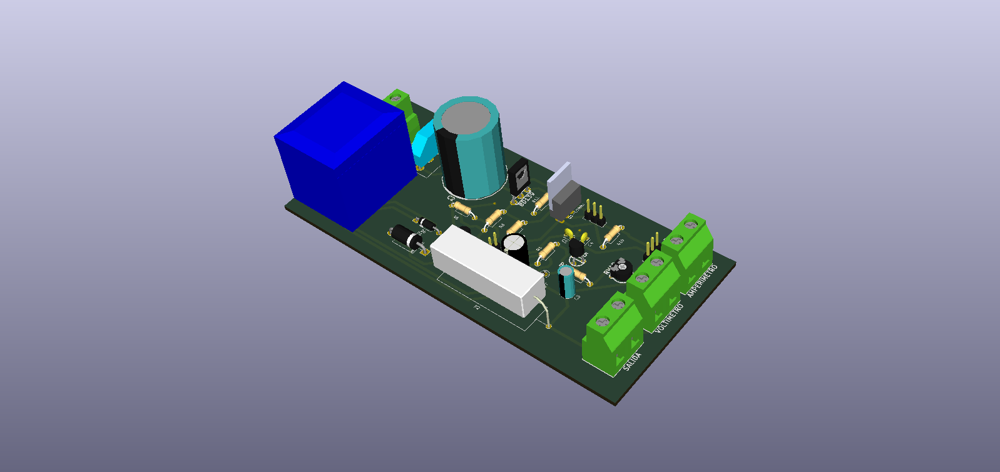
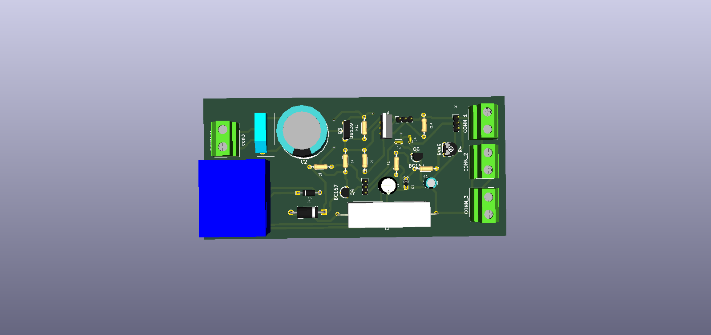

# Fuente-30V-de-Laboratorio
Esquema en kicad de la fuente de alimentacion para laboratorio creada por @Terrazocultor en su blog

http://100ciaencasa.blogspot.com.es/2014/06/circuitos-utiles-05-fuente-de.html

